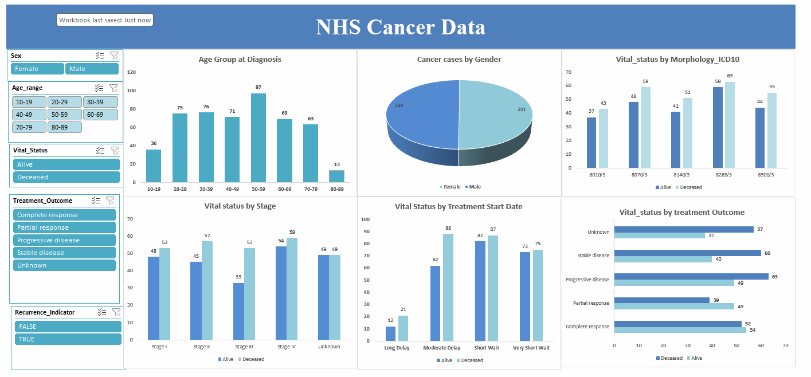

# Data Analytics Project

# Project 1

**Title:** [NHS Cancer Data](https://github.com/Victor7774/github.io-Victor7774/blob/main/NHS_Cancer_DataProject.xlsx)

**Tools Used:** Microsoft Excel (Tools used)

**Project Description:**[Developed an interactive Excel dashboard to analyse NHS cancer patient data. The dashboard enables users to filter records by sex,age group, treatment type, cancer type, and treatment period to identify trends in patient demographics, treatment outcomes, and healthcare performance. Excel Pivot Table, Pivot Charts, slicers and data visualization techniques were used to transform raw healthcare data into an easy to understand reporting dashboard.

**Key findings:**
I identified the age groups with the highest number of cancer diagnoses.
I compared cancer cases between male and female.
I analysed patient trend by recurrence indicator. 
I identified stage of cancer with the highest date rate.

**Dashboard Overview:**

# Project 2

**Title:** Football Data Extraction

**SQL Code:** [Footballdata-sql interogation](https://github.com/Victor7774/github.io-Victor7774/blob/main/Footballdata.SQL)

**SQL Skills Used:**

Data Retrieval (SELECT): Queried and extracted specific information from the database.

Data Aggregation (SUM, COUNT): Calculated totals, such as sales and quantities, and counted records to analyze data trends.

Data Filtering (WHERE, BETWEEN, IN, AND): Applied filters to select relevant data, including filtering by ranges and lists.

Data Source Specification (FROM): Specified the tables used as data sources for retrieval

**Project Description:** 
**Technology used: SQL server**
